# Political donations in war and in peace

## Description and motivation
In October 2012, the Colombian government started peace negotiations with the FARC guerrilla. This process would result in a unilateral ceasefire by the armed group in December 2014, and eventually the signing of the peace agreement in 2016.

The effects of the peace process with the FARC guerrilla have been heterogeneous. Municipalities with presence of the armed group experienced a relative large decrease in the number of violent events after the creasefire, according to data from the Conflict Analysis Resource Center (CERAC). They improved education outcomes (Prem et al., 2021) and their fertility rate (Guerra-Cújar et al., 2021). However, the process also generated perverse incentives that augmented deforestation (Prem, Saavedra, et al., 2020), illicit crops (Prem, Vargas, et al., 2020), and the assassination of social leaders (Marín Llanes, 2020). 

What is the impact of the peace process on private investment? *A priori,* one would expect an increase in this variable because the reduction in conflict and the benefits of the peace agreement in the affected areas should improve the business confidence. An especial type of investment are donations to political campaings. In this project I seek to identify if political donations increased in municipalities with FARC presence after the ceasefire and the peace agreement.

Project presentation in PDF (in Spanish) can be found [here](presentation/presentacion.pdf)

## Methods
### Web Scraping
- The app Cuentas Claras (https://www.cnecuentasclaras.gov.co/) contains three websites (one per year) that allow to download information on campaings' finance for all the candidates to three local elections: 2011, 2015 and 2019.
  - 2011: https://app.cnecuentasclaras.gov.co/CuentasClarasTer2010/publicacioncandidatos.aspx 
  - 2015: https://app.cnecuentasclaras.gov.co/CuentasClarasPublicoTer2015/Consultas/Candidatos/
  - 2019: https://app.cnecuentasclaras.gov.co/CuentasClarasPublicoTer2019/Consultas/Candidatos/
- All the websites are built using JavaScript and CSS. I use the R library *RSelenium* to get the list of all candidates for mayor in Colombian municipalities, and download the format 5.3B, which contains all private donations.
- These formats are in excel, and contain the name of the donor and the amount donated. The steps to download the information vary as follows:
  - For 2015 and 2019, the code gets the list of candidates, including an identifier. Then I used a loop to go to each candidate's page using their ID and download the list of donors. You can find the code for 2015 [here](code/get_donors_15.R) and the code for 2019 [here](code/get_donors_19.R).
  - I built two codes for 2011. [Get_donors_11](code/get_donors_11.R) goes through all websites with candidates to the municipality government, and downloads the datasets containing the donations. [Unify_donors_11](code/unify_donors_11.R) binds all the excel sheets and matches the donors with their candidates by name (given that for 2011 the electoral authority does not create an ID in Cuentas Claras). 
### Matching candidates and donors in Pandas 
- I used Python to create three databases (one per year) at the municipality level, containing the following variables of interest:
   - Total number of donors per municipality.
   - Average number of donors per candidate.
   - Total amount donated in the municipality.
   - Average amount of donations per candidate.
- This process involved the following steps:
   - Match the candidates with their donors for 2015 and 2019 using the politician's identifier.
   - Calculate the total amount for each candidate-donor pair, and the total number of donors and amount per candidate.
   - Compute the variables of interest by municipality
- You cand find the Jupyter Notebook code [here](code/merge_donors_datasets.ipynb)
### Making plots and maps in R
- I built the following figures in R using the donation aggregates at the municipality-year level:
  - Maps showing the spatial distribution of the outcomes of interest (one per variable and electoral year). You can find the code [here](code/animated-map-donors.R).
  - Top 10 municipalities with the highest average number of donors and amount donated (one per outcome). You can find the code [here](code/plot-rankofmpios.R).
  - Evolution of the otcomes of interest over the three electoral years, differentiating by status of FARC presence in 2011 (one figure per outcome). You can find the code [here](code/plot-evolutions-byfarc.R).
### Difference-in-difference to estimate the impact of the ceasefire on donation statistics
- I used the library *Fixest* to estimate a difference-in-difference design that identifies the impact of the ceasefire on donation statistics at the municipality level. The design was applied in the following TWFE equation:

 

This equation includes municipality fixed effects (i), and electoral year fixed effects (t). (Ceasefile x FARC) is a dummy taking the value of 1 for the municipalities with FARC presence after 2014 (ceasefire period), and zero if both conditions are not satisfied. The coefficient related to that variable is the difference-in-difference estimator. In this case, the standard errors are clustered at the municipality level.

- You can find the code that estimates the equations [here](code/run-twfe-regressions.R) .

## Findings
### Spatial distribution of the outcomes of interest (2011).
The following figures plot the spatial distribution of the outcomes of interest for 2011. The figures for the rest of electoral years can be found in the following [link](output/evol-by-municipality/)

The figures show that donors are specially concentrated in the big cities of the center and the Caribbean coast region, with some municipalities in the Pacific coast also standing out. The statistics of amount of donation follow a similar pattern.

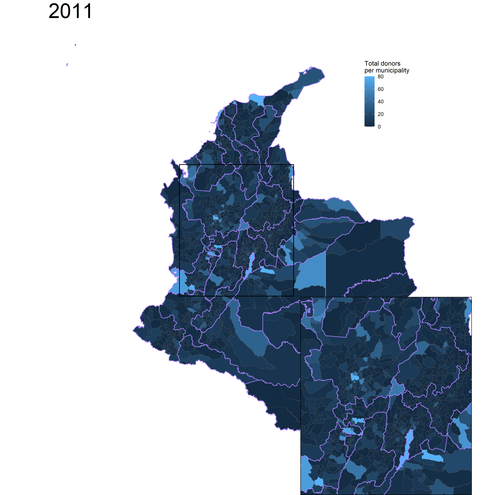 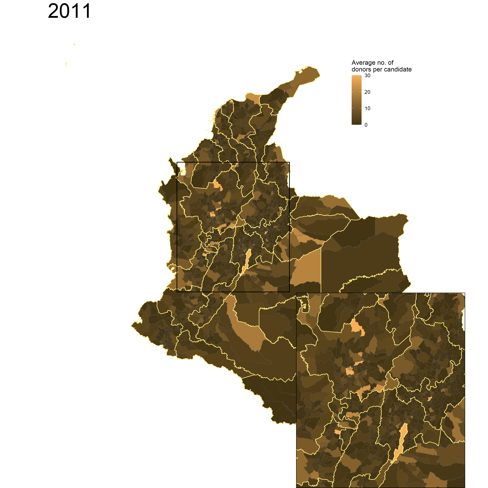
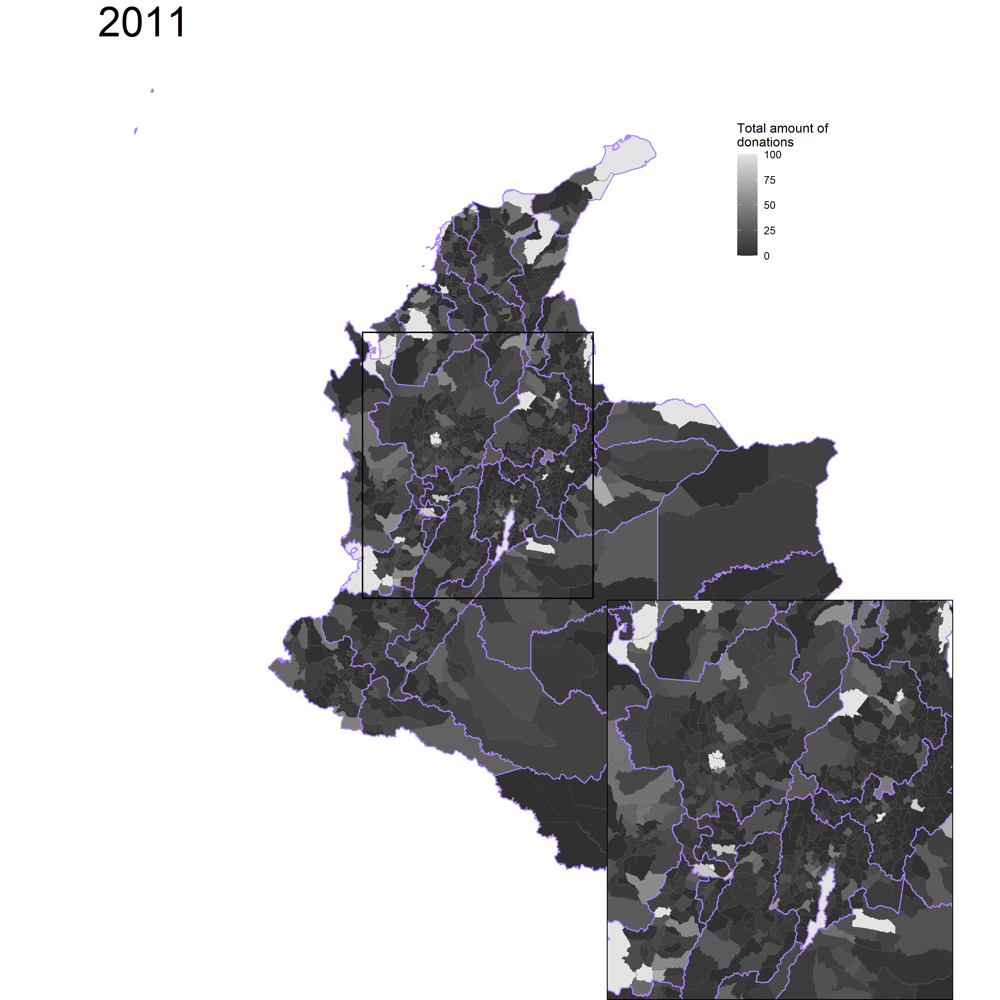 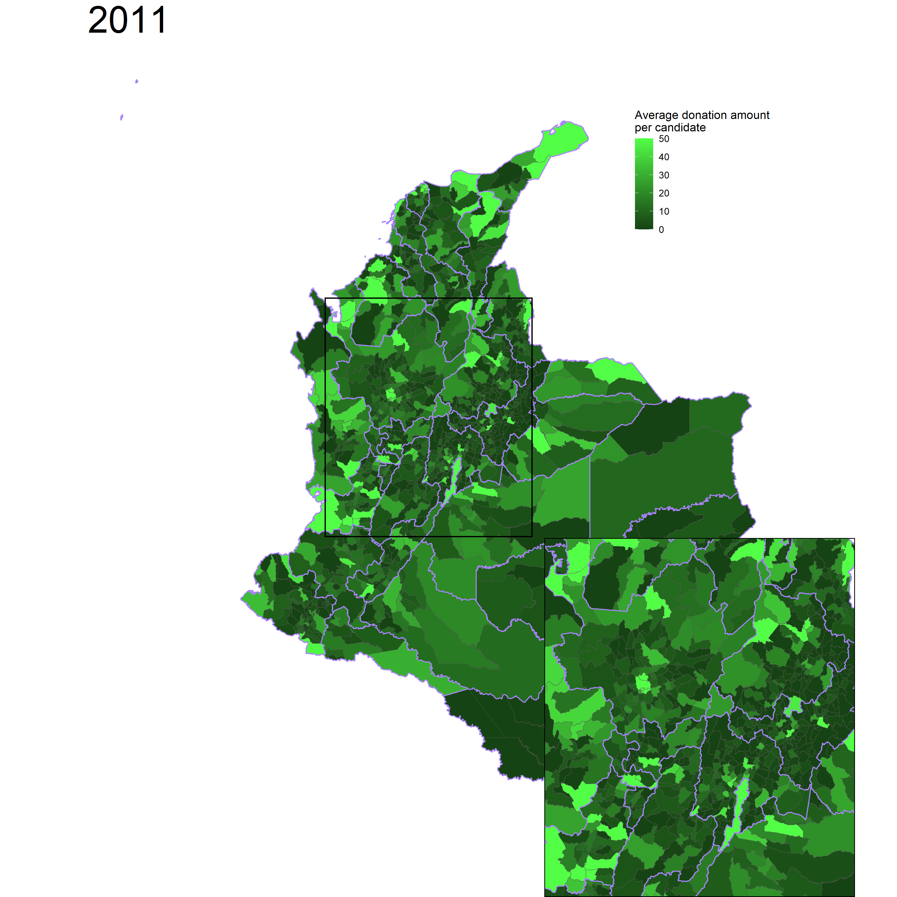

The figures below show the top 10 municipalities with the highest average value of the outcomes in the three electoral years, with those that had FARC presence by 2011 in red, and those without FARC in blue. The rankings are mainly formed by large capital cities such as Bogotá, Cali, and Barranquilla. However, other mid-sized municipalities also highlight, such as Tumaco in the Pacific Coast. 

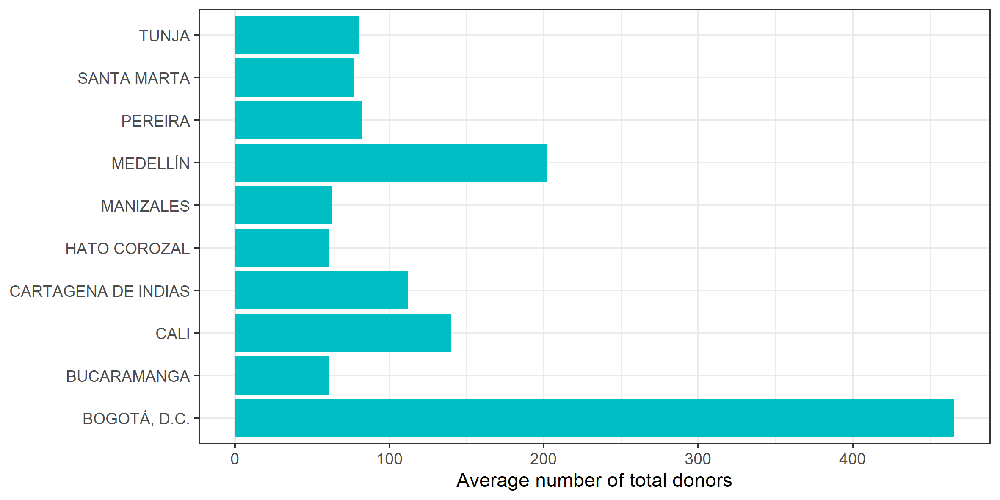 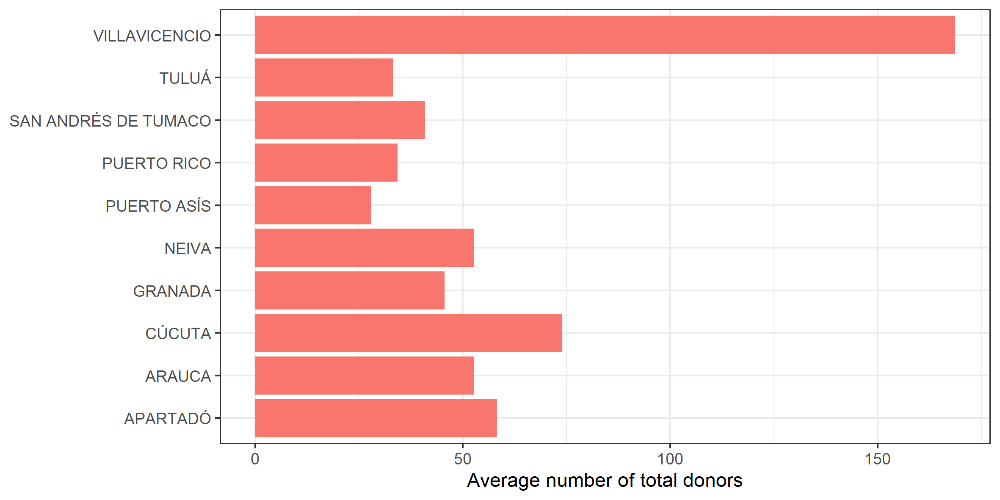
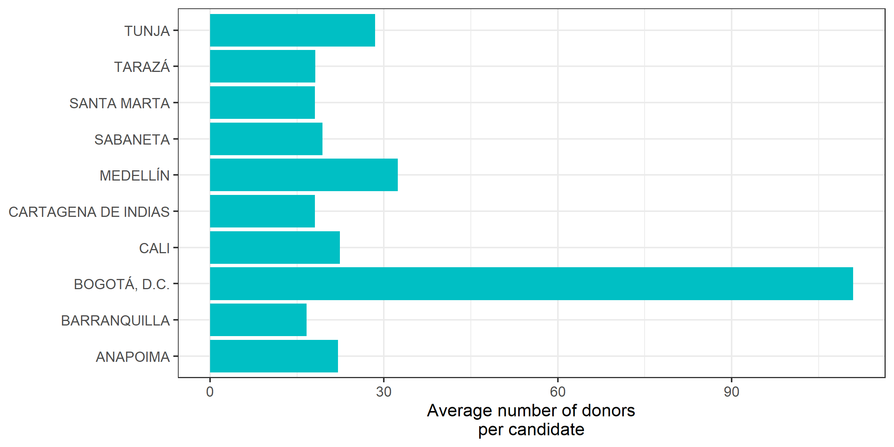 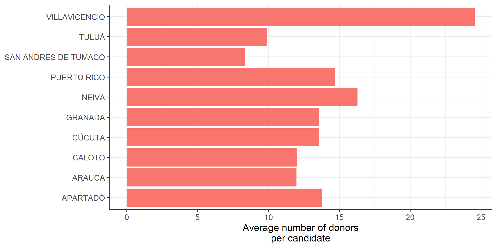
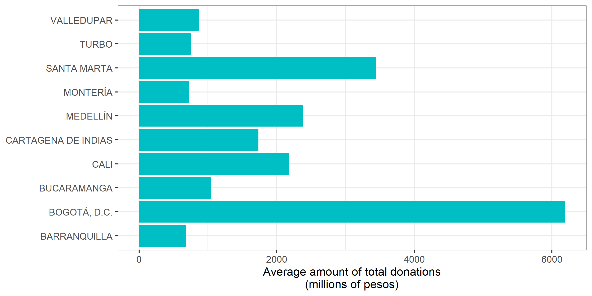 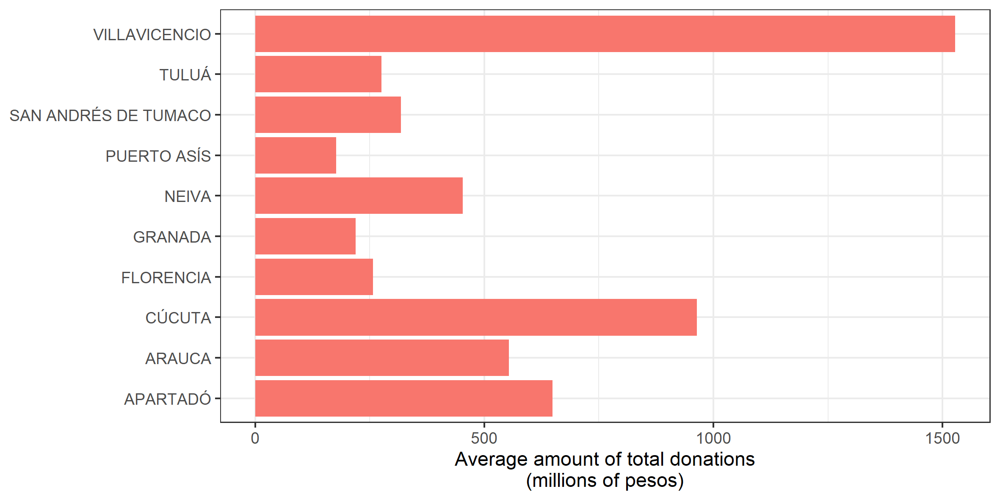

### Impact evaluation of the ceasefire and the peace agreement on private donations
The difference-in-differences design studies the evolution of the outcome in the treated group (in this case, municipalities with FARC presence by 2011) after the treatment period, and compares it with the evolution in the control group (municipalities without FARC in this project).

For this study, one would expect donations to have a relative increase in municipalities with FARC presence after the ceasefire in 2014. The following figures show the evolution of the four outcomes of interest averages. I find a differential growth in the total donation amount per municipality. However, the effect is not clear for the rest of the variables.  

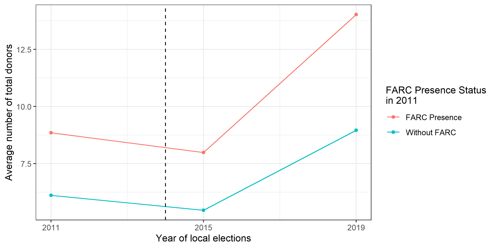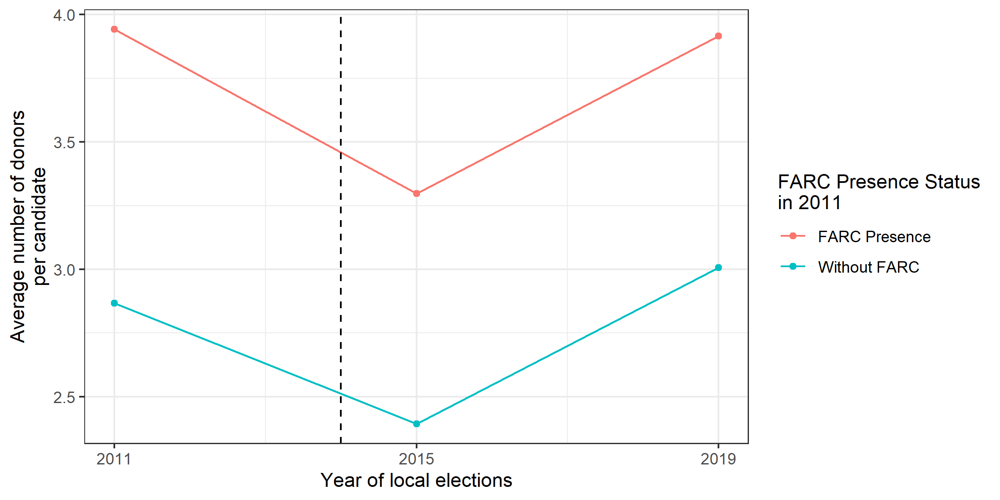
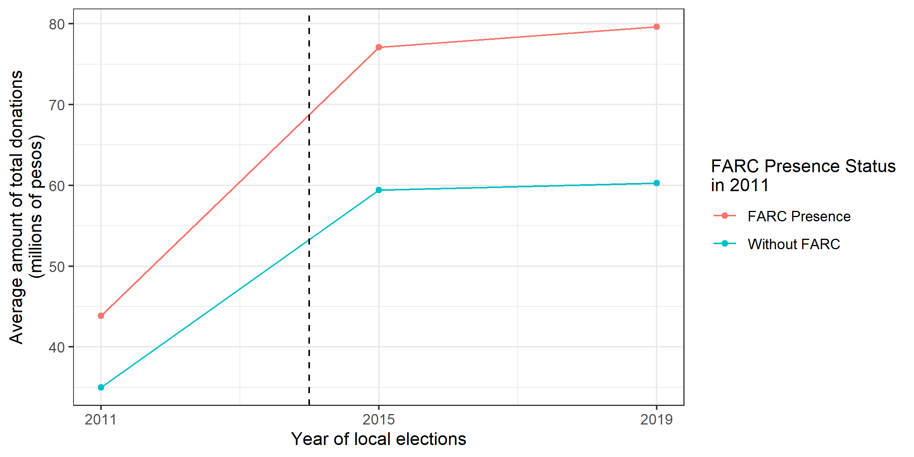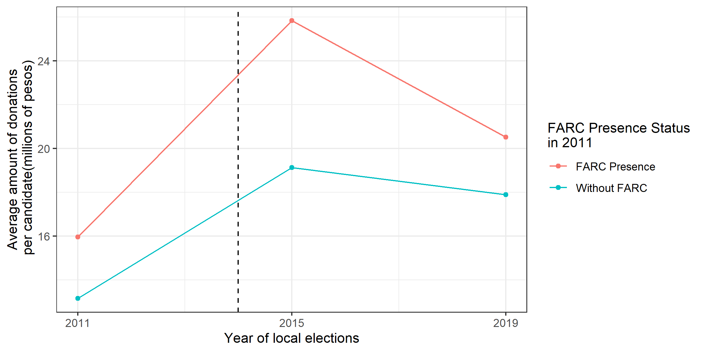

#### Difference-in-differences estimation results
The previous figures do not show a clear effect of the peace process on political donations. To estimate precisely the impact of the ceasefire and the peace agreement on the outcomes of interest, I estimate the two-way fixed effects equation presented in the methods section. The table below shows the coefficientes and their standard errors clustered at the municipality level in parentheses.

The coefficients are all positive, except for the outcome of average donors per candidate. However, none of them are statistically different from zero under a significance level smaller than 10%. Thus, at least for donations to candidates for mayor, I cannot conclude that the ceasefire (2014) and the peace agreement (2019) caused an increase in political investment. 

|       &nbsp;        |   Total donors    |   Donors per cand  |log(Total amount)|log(Amount per cand)|
|:-------------------:|:-----------------:|:------------------:|:---------------:|:------------------:|
|                     |                   |                    |                 |                    |
| **CEASEFIRExFARC**  |   1.057 (1.403)   |  -0.1621 (0.4312)  | 0.0429 (0.1418) |  0.0408 (0.1300)   |
| **Fixed-Effects:**  |   -------------   |  ----------------  | --------------- |  ----------------- |
|  **Municipality**   |        Yes        |        Yes         |       Yes       |         Yes        |
|      **Year**       |        Yes        |        Yes         |        Yes      |         Yes        |
| **_______________** |   _____________   |  ________________  | _______________ | __________________ |
| **S.E.: Clustered** |   by: Municip..   |  by: Municipality  | by: Municipal.. |   by: Municipal..  |
|  **Observations**   |       3,365       |       3,365        |      2,421      |        2,421       |
|       **R2**        |       0.779       |       0.547        |      0.726      |        0.676       |

## References
Guerra-Cújar, M. E., Prem, M., Rodríguez-Lesmes, P., & Vargas, J. F. (2021). A Peace Baby Boom? Evidence from Colombia’s Peace Agreement. https://doi.org/10.31235/osf.io/c2ypd

Marín Llanes, L. (2020). Unintended Consequences of Alternative Development Programs: Evidence From Colombia’s Illegal Crop Substitution. Documento CEDE, No. 40. https://doi.org/10.2139/ssrn.3706297

Prem, M., Saavedra, S., & Vargas, J. F. (2020). End-of-conflict deforestation: Evidence from Colombia’s peace agreement. *World Development, 129*, 104852. https://doi.org/https://doi.org/10.1016/j.worlddev.2019.104852

Prem, M., Vargas, J. F., & Mejía, D. (2020). The Rise and Persistence of Illegal Crops: Evidence from a Naïve Policy Announcement.

Prem, M., Vargas, J. F., & Namen, O. (2021). The Human Capital Peace Dividend. *Journal of Human Resources*. https://doi.org/10.3368/jhr.59.1.0320-10805R2 

